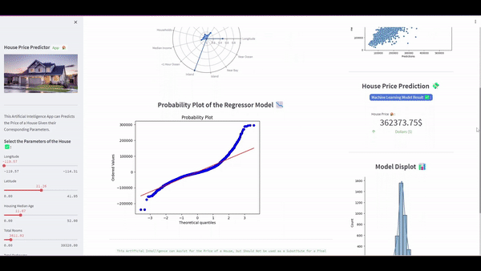
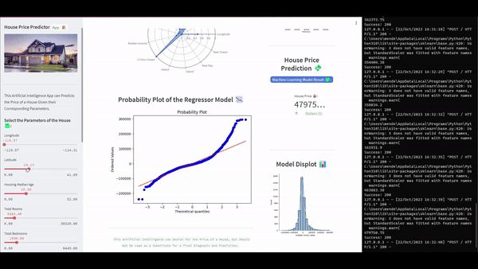

# House Price Prediction with Scikit Learn, Streamlit and Deployed with Flask



## House Price Prediction with Scikit Learn, Numpy, Pandas, Streamlit and Deployed with Flask 

The Model was trained with Tabular House Prices Dataset and with the `XGBRegressor` Architecture. The Model predicts the Price of a given House, also the U.I. to select the parameters of the House was built with Streamlit and the API with Flask. 

## Run it Locally

Test it Locally by running the `app.py` file, built with `Streamlit`, and the `api.py` file with `Flask`. Remember first to run the `api.py` file, copy the http url and saved in the API variable of the `app.py` file, and uncomment the code lines.

## App made with Streamlit
```sh
streamlit run app.py
```

## Deployed with Flash
```sh
python3 api.py
```



## Resources
- House Price Dataset: https://www.kaggle.com/datasets/shibumohapatra/house-price
